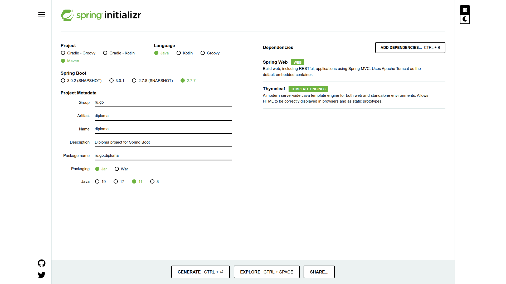
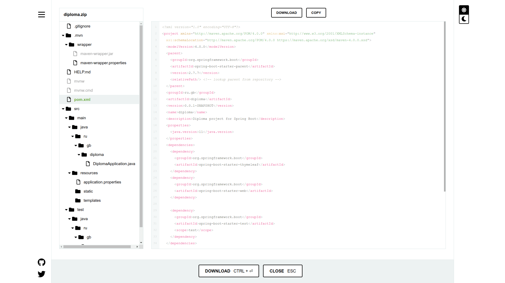

# Дипломный проект. Факультет разработчик - программист.

## 🟥 Задача

Дипломный проект называется "Инструкция по фреймворку Spring". Требуется подготовить подробную инструкцию согласно дипломной траектории Ильнара Шафигуллина. В рамках выбранной траектории для написания и оформления инструкции используется язык разметки [Markdown](https://en.wikipedia.org/wiki/Markdown "Ссылка на материал из Википедии"), система контроля версий [Git](https://en.wikipedia.org/wiki/Git "Ссылка на материал из Википедии"), а также сервис онлайн-хостинга репозиториев [GitHub](https://en.wikipedia.org/wiki/GitHub "Ссылка на материал из Википедии").

### О чем будет дипломный проект?

Данный дипломный проект расскажет и покажет, на примере создания простого Web-приложения, зачем и как используется Spring и почему он стал сегодня так популярен. Стоит отметить, что мой дипломный проект, будет выполнен в виде инструкции и поэтому рассчитан в первую очередь на начинающих разработчиков, планирующих связать свою профессиональную деятельность с языком Java. Для того, чтобы инструкция не получилась скучной, я рассмотрю два подхода к созданию Web-приложения, как с использованием Spring, что является целью дипломного проекта, так и без него. По моему мнению, эти два разных подхода помогут дополнительно продемонстрировать преимущества использования Spring и мотивировать начинающих разработчиков к его самостоятельному углубленному изучению.  

### Какие технологии будут использоваться?

На начальном этапе дипломного проекта планируется использовать ряд актуальных на сегодняшний день технологий, приведенных в таблице ниже. По мере выполнения дипломного проекта список технологий может незначительно изменяться, а их версии уточняться.

Технологии                         | Название
-----------------------------------|-------------------------------------------------------------------------------------------------------------------------------------------------
Операционная система             | [Linux Ubuntu 22.04.1 LTS](https://en.wikipedia.org/wiki/Ubuntu "Ссылка на материал из Википедии")
Интегрированная среда разработки | [IntelliJ IDEA Community Edition](https://en.wikipedia.org/wiki/IntelliJ_IDEA "Ссылка на материал из Википедии")
Язык программирования            | [Java 11 OpenJDK](https://en.wikipedia.org/wiki/OpenJDK "Ссылка на материал из Википедии")
Фреймворк                        | [Spring](https://en.wikipedia.org/wiki/Spring_Framework "Ссылка на материал из Википедии"), в том числе проект [Spring Boot](https://en.wikipedia.org/wiki/Spring_Framework#Spring_Boot "Ссылка на материал из Википедии") упрощающий настройку Web-приложений
Система автоматической сборки    | [Apache Maven](https://en.wikipedia.org/wiki/Apache_Maven "Ссылка на материал из Википедии")

## 🟦 Структура

```txt
diplomas/
└─ 2023-developer-faculty-programmer/
   ├─ images/
   │  ├─ spring_initializr_explore_page.png
   │  └─ spring_initializr_main_page.png
   ├─ code-examples/
   └─ README.md
```

Дипломный проект структурирован в одном каталоге. Каждое изменение содержания этого каталога будет отражено в таблице, приведенной ниже.

Каталоги и файлы                                                               | Описание
-------------------------------------------------------------------------------|-------------------------------------------------------------------------------------------------------------------------------------------------
`/diplomas/2023-developer-faculty-programmer`                                  | Каталог дипломного проекта
`/2023-developer-faculty-programmer/images/`                                   | Каталог графических файлов дипломного проекта
`/2023-developer-faculty-programmer/images/spring_initializr_explore_page.png` | Скриншот страницы сайта Spring Initializr после нажатия кнопки EXPLORE
`/2023-developer-faculty-programmer/images/spring_initializr_main_page.png`    | Скриншот главной страницы сайта Spring Initializr
`/2023-developer-faculty-programmer/code-examples/`                            | Каталог файлов с примерами кода
`/2023-developer-faculty-programmer/README.md`                                 | Описание дипломного проекта, его содержание, основной теоритический и практический материал, а также заключение и список использованных источников

## 🟪 Содержание

### [Введение](https://github.com/dfedoroff/diplomas/tree/main/2023-developer-faculty-programmer#%D0%B2%D0%B2%D0%B5%D0%B4%D0%B5%D0%BD%D0%B8%D0%B5-1)

### [Глава 1. Простое Spring MVC приложение](https://github.com/dfedoroff/diplomas/tree/main/2023-developer-faculty-programmer#%D0%B3%D0%BB%D0%B0%D0%B2%D0%B0-1-%D0%BF%D1%80%D0%BE%D1%81%D1%82%D0%BE%D0%B5-spring-mvc-%D0%BF%D1%80%D0%B8%D0%BB%D0%BE%D0%B6%D0%B5%D0%BD%D0%B8%D0%B5-1)
+ [1.1. Компоненты среды разработки](https://github.com/dfedoroff/diplomas/tree/main/2023-developer-faculty-programmer#11-%D0%BA%D0%BE%D0%BC%D0%BF%D0%BE%D0%BD%D0%B5%D0%BD%D1%82%D1%8B-%D1%81%D1%80%D0%B5%D0%B4%D1%8B-%D1%80%D0%B0%D0%B7%D1%80%D0%B0%D0%B1%D0%BE%D1%82%D0%BA%D0%B8)
+ [1.2. Роль Spring в разработке приложений](https://github.com/dfedoroff/diplomas/tree/main/2023-developer-faculty-programmer#12-%D1%80%D0%BE%D0%BB%D1%8C-spring-%D0%B2-%D1%80%D0%B0%D0%B7%D1%80%D0%B0%D0%B1%D0%BE%D1%82%D0%BA%D0%B5-%D0%BF%D1%80%D0%B8%D0%BB%D0%BE%D0%B6%D0%B5%D0%BD%D0%B8%D0%B9)
+ [1.3. Создание приложения](https://github.com/dfedoroff/diplomas/tree/main/2023-developer-faculty-programmer#13-%D1%81%D0%BE%D0%B7%D0%B4%D0%B0%D0%BD%D0%B8%D0%B5-%D0%BF%D1%80%D0%B8%D0%BB%D0%BE%D0%B6%D0%B5%D0%BD%D0%B8%D1%8F)
+ 1.4. Импорт в интегрированную среду разработки (IDE)

### Глава 2.
+ 2.1. 
+ 2.2.
+ 2.3.
+ 2.4.

### Глава 3.
+ 3.1.
+ 3.2.
+ 3.3.
+ 3.4.

## 🟩 Теоритический и практический материал

## Введение

// TODO - Написать вводную часть.

## Глава 1. Простое Spring MVC приложение

### 1.1. Компоненты среды разработки

В данном разделе описана установка и настройка окружения, необходимого в рамках подготовки дипломного проекта.

### Установка Java 11 OpenJDK

__Java Development Kit__ или __JDK__ – программный пакет, являющийся основным компонентом среды Java и предоставляющий все необходимые инструменты разработки на этом языке программирования. Для установки Java 11 OpenJDK на операционной системе Linux Ubuntu, откройте окно терминала и поочередно выполните следующие команды:

```bash
$ sudo apt-get update
$ sudo apt-get install openjdk-11-jdk
```

После окончания установки Java 11 OpenJDK необходимо проверить, прошла ли она успешно. Для этого введите в окне терминала команду:

```bash
$ javac --version
```

В случае успешной установки, в окне терминала вы увидите номер версии JDK:

```bash
javac 11.0.2
```

### Установка IntelliJ IDEA Community Edition

__IntelliJ IDEA Community Edition__ – бесплатная версия интегрированной среды разработки на базе открытого исходного кода от JetBrains. Хотя IntelliJ IDEA Community Edition обладает ограниченным функционалом, по сравнению с платной Ultimate версией, в ней реализована полная поддержка Java и ряда других языков программирования, включены инструменты тестирования, а также интеграция с системами контроля версий.

Для установки IntelliJ IDEA Community Edition на операционной системе Linux Ubuntu, откройте окно терминала и выполните поочередно следующие команды:

```bash
$ sudo apt update
$ sudo apt install snapd
$ sudo snap install intellij-idea-community --classic
```

После окончания установки IntelliJ IDEA Community Edition необходимо проверить, прошла ли она успешно. Для этого введите в окне терминала команду:

```bash
$ snap list
```

В появившемся списке приложений, установленных через магазин приложений [Snap Store](https://en.wikipedia.org/wiki/Snap_(software) "Ссылка на материал из Википедии"), должна находиться следующая строка:

```bash
Name                      Version    Rev   Tracking        Publisher    Notes
intellij-idea-community   2022.3.1   405   latest/stable   jetbrains✓   classic
```

[к содержанию](https://github.com/dfedoroff/diplomas/tree/main/2023-developer-faculty-programmer#-%D1%81%D0%BE%D0%B4%D0%B5%D1%80%D0%B6%D0%B0%D0%BD%D0%B8%D0%B5)

### 1.2. Роль Spring в разработке приложений

__Spring__ – это самый популярный фреймворк на основе языка Java для создания корпоративных приложений и предоставляющий разработчикам богатую экосистему проектов (модулей) для удовлетвория потребностей современных приложений. Далее перечислены основные проекты, входящие в экосистему Spring:

+ _Spring Boot_ автоматически настраивает компоненты приложения за вас, но при необходимости позволяет вам отменить настройки по умолчанию
+ _Spring Data_ упрощает доступ к реляционным и NoSQL хранилищам данных
+ _Spring Batch_ обеспечивает мощную основу для пакетной обработки данных
+ _Spring Security_ обеспечивает надежную систему безопасности приложений
+ _Spring Cloud_ предоставляет разработчикам набор инструментов для реализации общих паттернов распределенных систем
+ _Spring Integration_ реализует модели корпоративной интеграции для облегчения интеграции с другими корпоративными приложениями с использованием облегченного обмена сообщениями и декларативных адаптеров

Также существует множество других интересных проектов, нацеленных на решение других задач разработки современных приложений. С их списком можно ознакомиться перейдя по [ссылке](https://spring.io/projects "Ссылка на сайт Spring.io").

Поскольку Spring является очень гибким и настраиваемым фреймворком, он предоставляет несколько подходов для конфигурирования компонентов приложения. Разработчик может использовать стили конфигурации на основе JavaConfig и Annotation в одном и том же приложении. И хотя наличие выбора обычно лучше, чем его отсутствие, это может стать сложным препятствием на пути начинающих разработчиков, которые могут запутаться в том, какого подхода следует придерживаться. Здесь им на помощь приходит Spring Boot, решающий эту проблему с помощью мощного механизма автоконфигурирования.

__Spring Boot__ – это проект, придерживающийся подхода "соглашения по конфигурации" (convention over
configuration), что помогает создавать приложения на основе Spring быстро и легко. Соглашения по конфигурации — это принцип построения фреймворков и библиотек, позволяющий сократить объем требуемой конфигурации без потери гибкости. Отсюда вытекает основная цель Spring Boot – помочь разработчикам быстро создавать приложения на основе Spring без необходимости писать одну и ту же шаблонную конфигурацию снова и снова.

В дополнение стоит отметить, что в последние годы [микросервисы](https://en.wikipedia.org/wiki/Microservices "Ссылка на материал из Википедии") стали популярным архитектурным решением при создании сложных корпоративных приложений. Spring Boot является отличным выбором для построения приложений на основе микросервисов с использованием различных модулей Spring.

[к содержанию](https://github.com/dfedoroff/diplomas/tree/main/2023-developer-faculty-programmer#-%D1%81%D0%BE%D0%B4%D0%B5%D1%80%D0%B6%D0%B0%D0%BD%D0%B8%D0%B5)

### 1.3. Создание приложения

Для создания проекта на основе Spring Boot необходимо открыть сайт [Spring Initializr](https://start.spring.io/ "Ссылка на сайт Spring Initializr") и заполнить информацию о проекте, указав следующие параметры:



После того, как вы заполнили все требуемые поля, нажмите на кнопку `EXPLORE` внизу текущей web-страницы. В результате откроется новая страница, где будет показана структура созданного вами проекта:



Нажмите на кнопку `DOWNLOAD` внизу страницы, чтобы скачать проект в виде Zip-файла. Этот файл содержит пустой проект
с файлом сборки, включающим все настройки проекта.

Теперь давайте подробнее рассмотрим выбранные параметры проекта.

__Apache Maven__ – это инструмент автоматизации сборки проектов, используемый для создания и управления проектами написанными на языке Java. Структура проекта и детали его конфигурации описываются в файле `pom.xml` на XML-языке POM (Project Object Model), который находится в корневой папке проекта. Данный файл используется Maven для автоматизации сборки проекта.

Основные преимущества:
+ Независимость от операционной системы. Так как файл проекта один и тот же, сборка проекта происходит на любой ОС
+ Гибкое управление зависимостями. Проекты не пишутся без использования сторонних библиотек (зависимостей) разных версий. Чтобы разрешать конфликты версий, Maven умеет подгружать в свой локальный репозиторий требуемые версии библиотек, а при необходимости переходить на их новые версии
+ Сборка проекта из командной строки позволяет собирать проект непосредственно на сервере
+ Хорошая интеграция со средами разработки (IDE)
+ Декларативное описание проекта на XML-языке POM (Project Object Model). Все необходимые параметры проекта настроены по умолчанию и поэтому разработчику не нужно вникать в каждый аспект его сборки
+ Модульная архитектура, расширяемая за счет большого количества плагинов
+ Актуальный и большой репозиторий артефактов

__Java 11__ – это объектно-ориентированный язык программирования общего назначения, а 11 версия является предпоследней LTS-версией этого языка. Язык Java применяется в разработке широкого спектра программного обеспечения, не имеющего строгой привязки к конкретной сфере использования.

Основные преимущества:
+ Независимость от платформы или операционной системы. Это означает, что благодаря виртуальной машине Java (JVM) программа написанная на Java, может использоваться на разных платформах или операционных системах
+ Надежный язык программирования. Объектно-ориентированная природа Java позволяет избегать критических ошибок в процессе разработки программного обеспечения
+ Масштабируемость. По мере роста компании и усложнения используемых Web-приложений удается относительно легко обеспечивать безотказную работу кода
+ Безопасность. Еще на этапе проектирования языка Java, его создатели в компании Sun Microsystems стремились сделать Java безопасным настолько, насколько это возможно

Начинающие разработчики часто устанавливают последнюю версию Java, а не последнюю версию Java LTS. Каждая основная версия Java не является версией Java LTS. Например, Java 19 не является LTS-версией. В большинстве случаев, особенно если это сервер, вы наверняка захотите использовать именно LTS-версию Java.

_Что такое версия Java LTS?_

LTS означает Long Term Support (Долгосрочная поддержка), а это значит, что вендор Java (например, компания Oracle) будет поддерживать LTS-версию в течение длительного времени. Поэтому, в течение нескольких лет, используемая вами LTS-версия Java хотя и не получит серьезных функциональных обновлений, однако она получит исправления проблем безопасности.

_Какая последняя версия Java LTS?_

На момент подготовки дипломного проекта Java 17 является последней LTS-версией. Java 17 LTS вышла в сентябре 2021 года и будет поддерживаться до сентября 2026 года. Расширенная поддержка Java 17 LTS продлится до сентября 2029 года.

_Почему не использовать Java 17 LTS в дипломном проекте?_

Здесь следует вспомнить пословицу: "Лучшее – враг хорошего". Во-первых, целью данного дипломного проекта не является применение самых последних версий программного обеспечения. Главная задача состоит в том, чтобы дипломный проект был качественно выполнен в установленные сроки. К тому же в жизни вы наверняка не раз сталкивались с нестабильной работой свежих версий программного обеспечения. Поэтому LTS-версию Java 17, являющуюся к тому же минимальной версией для работы со Spring Boot 3.0.1, вышедшим лишь 22 декабря 2022 года, стоит отложить до следующего дипломного проекта. Во-вторых, на реальных коммерческих проектах чаще встречаются LTS-версии Java 8 или 11, нежели 17. Поэтому применение Java 11 LTS на текущем проекте будет не менее, если не более полезным.

_Сколько лет поддерживается версия Java LTS?_

Поддержка Java 11 LTS составляет 8 лет (до сентября 2026 года). Восемь лет поддержки версии программного обеспечения – это долгий срок, поэтому он и называется LTS. Некоторые старые LTS-версии Java поддерживались даже более 8 лет. Java 7 LTS имела срок поддержки 11 лет, а Java 8 LTS рекордные 16 лет! Для сравнения, не-LTS версия Java поддерживается всего 6 месяцев.

_Когда выйдет следующая LTS-версия Java?_

Java 21 станет следующей LTS-версией Java и будет выпущена в сентябре 2023 года.

__Spring Boot__ – это проект с открытым исходным кодом, разработанный компанией Pivotal Software. Стоит отметить, что Spring Boot и Spring – разные технологии, и Spring Boot по сути является расширением Spring. В свою очередь Spring является сложной экосистемой разработки на языке Java, включающей в себя большое число готовых модулей. Именно поэтому скорость и простота использования делают Spring Boot популярным решением для создания надежных, автономных, масштабируемых приложений на базе Spring. Spring Boot дает разработчику возможности гибкой настройки, надежной пакетной обработки и множество других инструментов, позволяющих сосредоточиться на решении бизнес-задач.

Основные преимущества:
+ Создание полноценных Spring приложений
+ Встроенный контейнер сервлетов Tomcat, не требующий установки War-файлов
+ Предоставление "стартовых" зависимостей для упрощения конфигурации сборки проекта
+ Автоматическая конфигурация Spring и сторонних библиотек когда это возможно
+ Наличие готовых решений: метрики, мониторинг состояния и расширенная конфигурация
+ Абсолютно без генерации кода и написания XML-конфигурации

__Jar__ – это классический формат Java-архива. Согласно стандартной практике, приложение содержащее более нескольких десятков строк кода, разбивается на несколько классов. Именно при распространении такого приложения и используется формат `Jar`. Следовательно, Spring Boot Jar – это самодостаточный `Jar`, содержащий коллекцию всех зависимостей, необходимых для запуска приложения.

В данном проекте нет причин для выбора файлов `War` (например, поддержка определенного сервера приложений
или другие унаследованные причины), поэтому лучше выбрать `Jar` в качестве механизма упаковки. Файлы `Jar` имеют отличную поддержку со стороны команды разработчиков Spring Boot, и поэтому позволяют запускать Web-приложение напрямую через встроенный в Spring Boot контейнер сервлетов Tomcat. Это избавляет разработчика от дополнительной установки и настройки Tomcat и развертывания в нем приложения.

__Spring Web__ – это зависимость, позволяющая создавать web-приложения, в том числе RESTful, с помощью Spring MVC. Использует Apache Tomcat в качестве встроенного контейнера по умолчанию.

__Thymeleaf__ – это зависимость, являющаяся современным серверным движком шаблонов Java как для web-, так и для автономных сред. Позволяет корректно отображать HTML в браузерах и в виде статических прототипов.

// TODO - 1.4. Импорт в интегрированную среду разработки (IDE)

[к содержанию](https://github.com/dfedoroff/diplomas/tree/main/2023-developer-faculty-programmer#-%D1%81%D0%BE%D0%B4%D0%B5%D1%80%D0%B6%D0%B0%D0%BD%D0%B8%D0%B5)

## 🟧 Заключение

## 🟫 Список использованных источников
